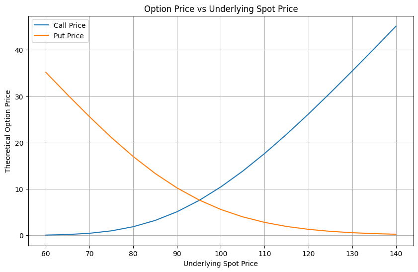
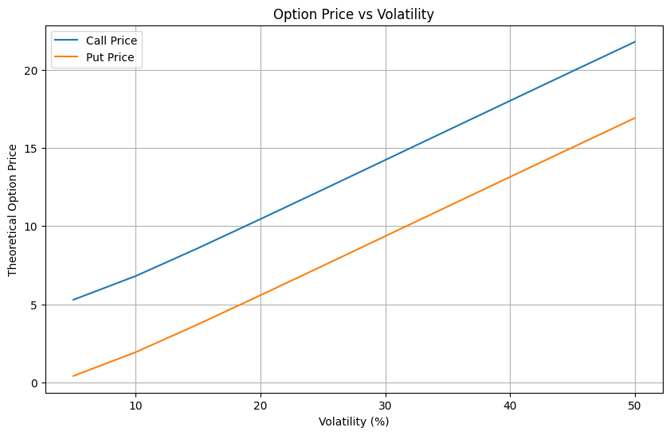
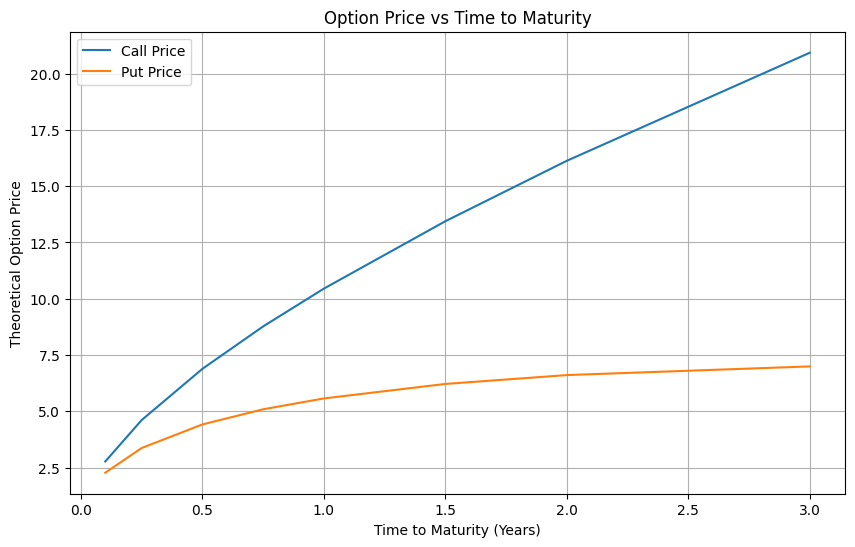
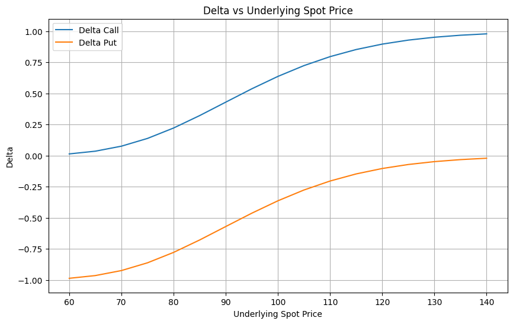
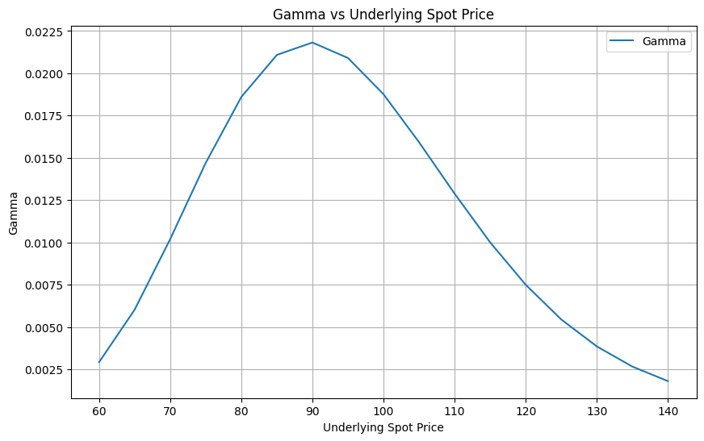
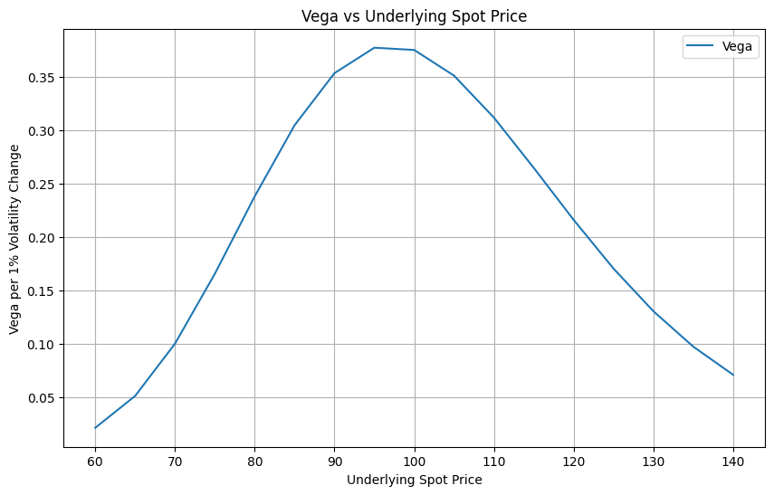
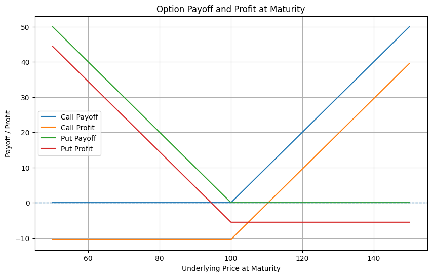

# Black-Scholes Option Lab

Excel and Python implementation of the Black-Scholes model for European option pricing, Greeks calculation, sensitivity analysis and payoff visualisation.

## Project Overview

The objective of this project is to build and understand the Black-Scholes framework for pricing European call and put options.

The project was developed in two stages:

1. **Excel model** to understand the mechanics step by step.
2. **Python implementation** to automate pricing, Greeks calculation, sensitivity analysis and payoff visualisation.

The model uses the following core inputs:

- Spot price
- Strike price
- Time to maturity
- Risk-free rate
- Volatility
- Dividend yield

---

## Black-Scholes Formula

For a European call option with continuous dividend yield:

$$
C = S_0 e^{-qT} N(d_1) - K e^{-rT} N(d_2)
$$

For a European put option:

$$
P = K e^{-rT} N(-d_2) - S_0 e^{-qT} N(-d_1)
$$

Where:

$$
d_1 = \frac{\ln(S_0/K) + (r - q + 0.5\sigma^2)T}{\sigma\sqrt{T}}
$$

$$
d_2 = d_1 - \sigma\sqrt{T}
$$

---

## Excel Model

The Excel version was built first in order to understand the model logic step by step.

It includes:

- Model inputs
- Calculation of \(d_1\) and \(d_2\)
- Cumulative normal probabilities
- Call and put option pricing
- Put-call parity check
- Greeks calculation
- Sensitivity analysis
- Dashboard visualisation

### Excel Dashboard


---

## Python Implementation

The Python notebook replicates the Excel logic and extends the analysis through reusable functions and cleaner visualisations.

Main components included in the notebook:

- Model inputs
- Intermediate calculations: \(d_1\), \(d_2\), \(N(d_1)\), \(N(d_2)\)
- Black-Scholes pricing function
- Greeks function
- Put-call parity check
- Sensitivity analysis
- Payoff and profit diagrams

---

## Base Case Inputs

The base case used throughout the project is:

- Spot Price: 100
- Strike Price: 100
- Time to Maturity: 1 year
- Risk-Free Rate: 5%
- Volatility: 20%
- Dividend Yield: 0%

Under these assumptions, the model gives approximately:

- **Call Price = 10.45**
- **Put Price = 5.57**

---

## Put-Call Parity

The project also includes a put-call parity consistency check:

$$
C - P = S_0 e^{-qT} - K e^{-rT}
$$

This relationship is useful as a no-arbitrage validation of the model outputs.

---

## Greeks

The notebook calculates the main option Greeks:

- **Delta**: sensitivity of the option price to changes in the underlying spot price
- **Gamma**: sensitivity of Delta to changes in the underlying spot price
- **Vega**: sensitivity of the option price to changes in volatility
- **Theta**: sensitivity of the option price to the passage of time
- **Rho**: sensitivity of the option price to changes in interest rates

For the base case, the model produces values approximately equal to:

- Delta Call: 0.6368
- Delta Put: -0.3632
- Gamma: 0.0188
- Vega: 0.3752
- Theta Call: -0.0176
- Theta Put: -0.0045
- Rho Call: 0.5323
- Rho Put: -0.4189

---

## Sensitivity Analysis

The project studies how option prices and Greeks change as key inputs vary.

### 1. Option Price vs Underlying Spot Price



### 2. Option Price vs Volatility



### 3. Option Price vs Time to Maturity



### 4. Delta vs Spot Price



### 5. Gamma vs Spot Price



### 6. Vega vs Spot Price



---

## Payoff and Profit Diagrams

The project also distinguishes between **payoff at maturity** and **profit after premium paid** for simple long option positions.

- Long Call
- Long Put



The payoff is the option value at expiration:

$$
\text{Call Payoff} = \max(S_T - K, 0)
$$

$$
\text{Put Payoff} = \max(K - S_T, 0)
$$

Profit is equal to payoff minus the premium paid.

---

## Project Structure

```text
black-scholes-option-lab/
│
├── excel/
│   └── black_scholes_option_lab.xlsx
│
├── notebooks/
│   └── black_scholes_option_lab.ipynb
│
├── images/
│   ├── excel_dashboard.png
│   ├── option_price_vs_spot.png
│   ├── option_price_vs_volatility.png
│   ├── option_price_vs_time_to_maturity.png
│   ├── delta_vs_spot.png
│   ├── gamma_vs_spot.png
│   ├── vega_vs_spot.png
│   └── option_payoff_and_profit.png
│
├── README.md
└── .gitignore
